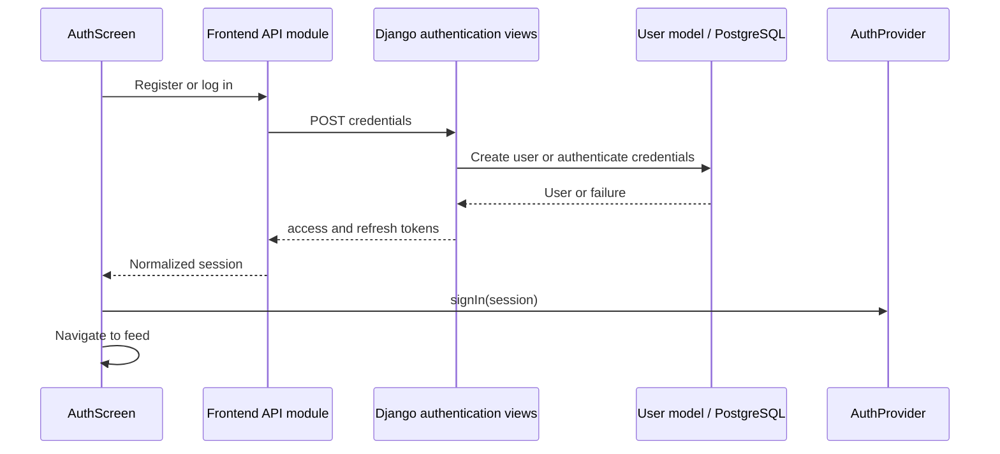

# Milestone 1: Component Designs and Patterns

These designs describe the current implementation. They supplement the [architecture ADR](../architecture/adr-001-modular.monolith.md) and [design classes](../design/design-classes.md); they do not redefine the shared API contract.

## Authentication use case

[AuthScreen](../../frontend/src/screens/AuthScreen.jsx) collects credentials and calls the centralized [API module](../../frontend/src/api.js). Registration additionally sends `displayName`. Backend [authentication views](../../backend/app/routes/auth.py) handle registration and SimpleJWT login. Registration delegates through the user service/repository to `UserManager.create_user`, which normalizes email and hashes the password with Django's `set_password`.



Failed requests leave an error on the form. Protected requests attach `Authorization: Bearer <access>`. The frontend optionally decodes the JWT identity claim for display/self-follow controls; this is not signature verification. Django authenticates requests. A protected-request 401 clears the client session and opens login. Logout and reload discard in-memory session state; no automatic refresh is performed.

## Post creation and feed use case

[ComposeScreen](../../frontend/src/screens/ComposeScreen.jsx) validates the draft and manages upload/publish progress. The backend [post view](../../backend/app/routes/post_views.py) validates requests, then delegates through [post_service](../../backend/app/services/post_service.py) and [post_repository](../../backend/app/repositories/post_repository.py) to the ORM. Uploaded file content uses Django media storage; PostgreSQL stores model records and file references.

```mermaid
sequenceDiagram
    participant UI as ComposeScreen
    participant API as Frontend API module
    participant Views as Django media/post views
    participant Data as Services / repositories / storage
    participant Feed as FeedScreen
    opt Image selected
        UI->>API: uploadImage(file)
        API->>Views: POST /api/media multipart file
        Views->>Data: Store uploaded image
        Views-->>UI: Upload URL through API adapter
    end
    UI->>API: publishPost(draft)
    API->>Views: POST /api/posts (JSON text or multipart image)
    Views->>Data: Create Post
    Views-->>API: Direct Post response on success
    API-->>UI: Adapted Post
    UI->>Feed: Navigate after successful publication
    Feed->>API: GET /api/posts with page/filter
    API->>Views: Fetch posts
    Views->>Data: Filter and order query; paginate results
    Views-->>API: count, next, previous, results
    API-->>Feed: posts, page, hasMore
```

Text requests omit `media`. Image requests retain the upload-first step but submit the original file again because the current post serializer requires an image file, not an upload URL. The backend's `author_id` upload-path defect currently blocks that image-save path; the diagram's success response is conditional, not a verification claim.

Feed filters use `onlyFollowing` and `liked`. The [response adapter](../../frontend/src/contract.js) maps `created_at`, converts the likes relationship array to a count, and reads `media_url`/`media`. [PostCard](../../frontend/src/components/PostCard.jsx) sends social actions through the API module and triggers a feed refresh. Errors retain visible feedback; loading and empty results have separate states. Leaving the composer discards its draft.

## Patterns and rationale

| Pattern | Implementation | Why it helps SocialLens |
| --- | --- | --- |
| Context / Provider | [AuthContext](../../frontend/src/auth/AuthContext.js), [AuthProvider](../../frontend/src/auth/AuthProvider.jsx), and `useAuth` | Shares session and sign-in/sign-out operations across screens without repeatedly passing state through unrelated components. Memory-only storage keeps session lifetime explicit. |
| Centralized API facade and response adapters | [api.js](../../frontend/src/api.js) and [contract.js](../../frontend/src/contract.js) | Centralizes routes, Bearer headers, JSON/multipart handling, cancellation, and errors. Converts backend payloads into stable UI data so serialization corrections do not spread across components. |
| Layered backend | Routes → services → repositories → Django ORM | Separates HTTP validation from application operations and data access, following ADR-001. SimpleJWT owns the login path; not every operation traverses custom service/repository modules. |
